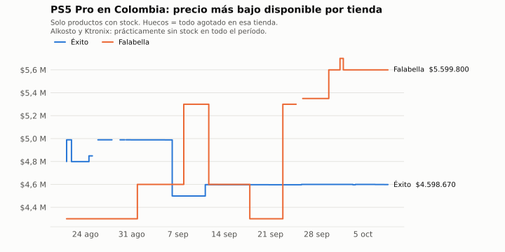
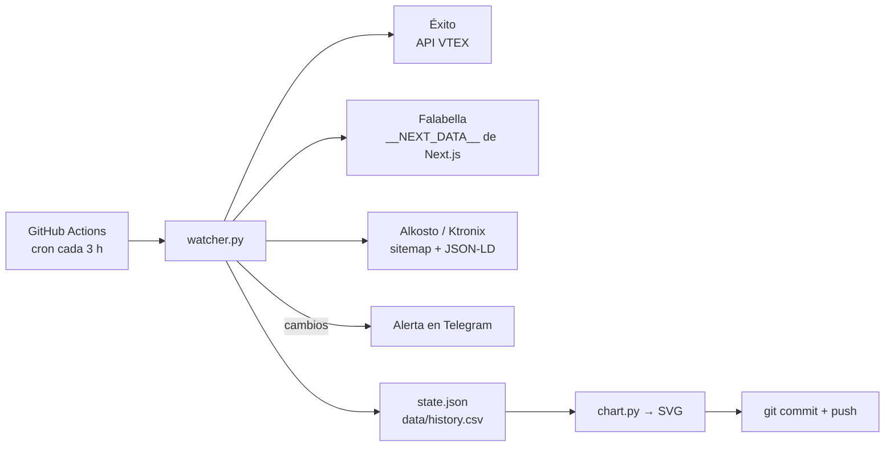

# PS5 Pro Watcher 🎮

[](https://github.com/DonadoM/ps5-pro-watcher/actions/workflows/tests.yml)

Bot que vigila el precio y el stock de la **PS5 Pro** en tiendas colombianas (Éxito, Falabella, Alkosto, Ktronix) y avisa por **Telegram** cuando algo cambia. Corre solo en **GitHub Actions**: sin servidor, sin PC encendido y sin costo.

> *A serverless bot that tracks PS5 Pro prices and stock across Colombian retailers and alerts via Telegram. Runs every 3 hours on GitHub Actions cron and uses git itself as its price-history database.*

<picture>
  <source media="(prefers-color-scheme: dark)" srcset="docs/price-history-dark.svg">
  
</picture>

*La gráfica se regenera sola en cada ejecución a partir de [`data/history.csv`](data/history.csv).*

## Lo que descubrió

- **$1,3 millones más en seis semanas.** En Falabella las versiones más baratas se agotaron y solo quedaron combos: el precio más bajo para conseguir una PS5 Pro pasó de $4.299.900 a $5.599.800.
- **Bots contra bots.** En Éxito algunos productos cambian de precio unos pocos pesos cada pocas horas (repricing automático). De 111 cambios de precio detectados, **84 fueron menores al 1%**.
- **Alkosto y Ktronix** (el mismo catálogo) no tuvieron la consola disponible en todo el período.

## Cómo funciona



Cada tienda expone sus datos de forma distinta, así que hay un adaptador por plataforma en [`stores.py`](stores.py):

| Tienda | Técnica |
|---|---|
| Éxito | API pública de catálogo de VTEX (`/api/catalog_system/pub/products/search`) |
| Falabella | JSON embebido por Next.js en `<script id="__NEXT_DATA__">` |
| Alkosto, Ktronix | Descubrimiento por `sitemap-productos.xml` + datos estructurados JSON-LD de schema.org |

Un filtro (`is_ps5_pro_console`) descarta accesorios, juegos y otros modelos que aparecen al buscar "PS5 Pro".

### Decisiones de diseño

- **Git como base de datos.** El estado se guarda en `state.json` y cada cambio queda en un commit. Así el historial completo de precios sale gratis: [`tools/backfill_history.py`](tools/backfill_history.py) reconstruyó `data/history.csv` desde más de 100 commits.
- **Alertas sin ruido.** Un producto tiene que faltar en **2 ejecuciones seguidas** para avisar que se agotó, porque los buscadores de las tiendas a veces lo omiten una vez. Si una tienda falla o devuelve cero resultados, se conserva su estado anterior en lugar de "agotar" todo. Los cambios de precio menores a `min_change_pct` se registran en el historial pero no generan alerta, y se miden contra el último precio avisado para que una bajada lenta igual llegue.
- **Gráfica reproducible.** `chart.py` genera SVGs deterministas (claro y oscuro), así que solo hay commit cuando cambian los datos.

## Configurarlo

1. Haz fork del repo.
2. Crea un bot con [@BotFather](https://t.me/BotFather) y obtén tu chat ID.
3. En **Settings → Secrets and variables → Actions** agrega:
   - Secrets: `TELEGRAM_BOT_TOKEN`, `TELEGRAM_CHAT_ID`
   - Variable (opcional): `THRESHOLD_COP`, el precio bajo el cual quieres una alerta especial
4. Ejecuta el workflow **PS5 Pro price watch** desde la pestaña Actions o espera al siguiente cron.

En repositorios públicos GitHub Actions es gratis. En privados, este bot usa unos 250 minutos al mes, dentro de la cuota incluida.

### Opciones (`config.example.json`)

| Clave | Qué hace |
|---|---|
| `search_terms` | Términos de búsqueda en las tiendas |
| `threshold_cop` | Alerta especial cuando el precio cruza este valor |
| `min_change_pct` | Cambio mínimo de precio (%) para alertar. Default: 1 |
| `stores_enabled` | Activa o desactiva tiendas |
| `direct_urls` | URLs de producto específicas para Alkosto/Ktronix (si no, usa el sitemap) |

## Desarrollo local

```bash
pip install -r requirements.txt
python -m unittest discover -s tests   # tests
python watcher.py --dry-run            # consulta las tiendas reales sin enviar ni guardar nada
python smoke_test.py                   # lista los precios actuales por tienda
python chart.py --png                  # regenera la gráfica (+ PNG para compartir)
```

## Licencia

[MIT](LICENSE)
